# 👋 Hello there! I am Jason Limon

### I am Java Developer/Software Engineer

* I'm currently looking for new job 🏢
* Currently I'm learning Kubernetes and AWS ☁️ 📖
* I would like to learn Go or Python 💻
* Connect with me [LinkedIn](https://www.linkedin.com/in/jason-limon-bab886170/) 

## My favortite Tech

>Tools, languages, and other things that I like to work with.

| 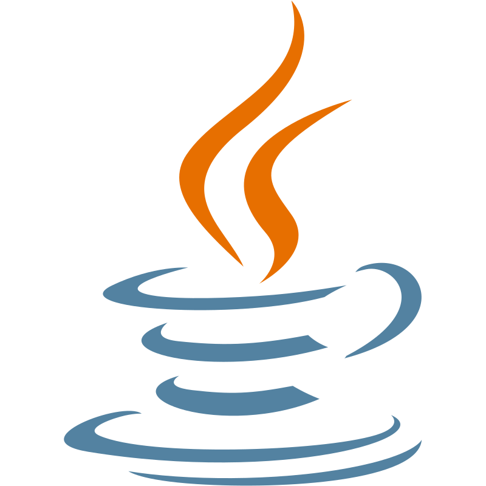   Java | 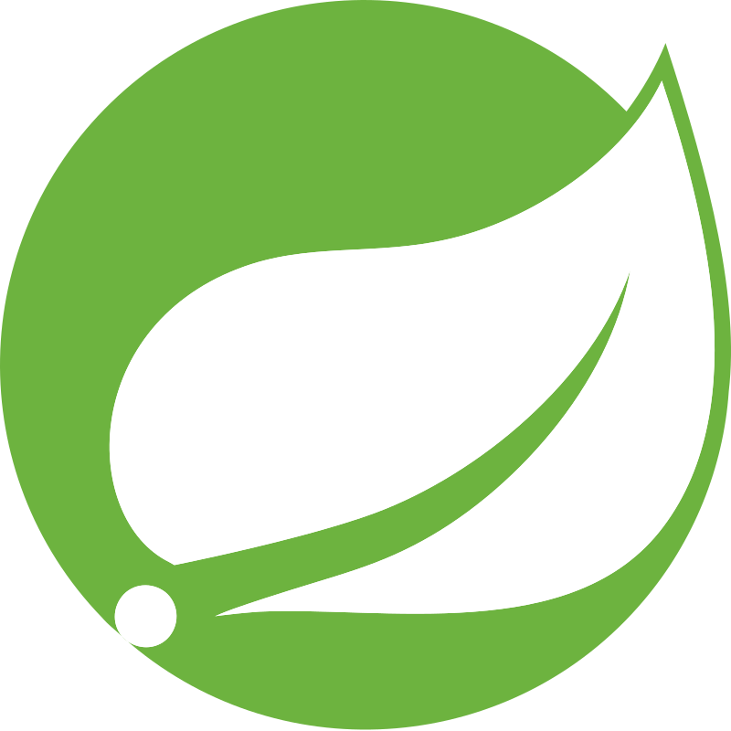   SpringBoot | 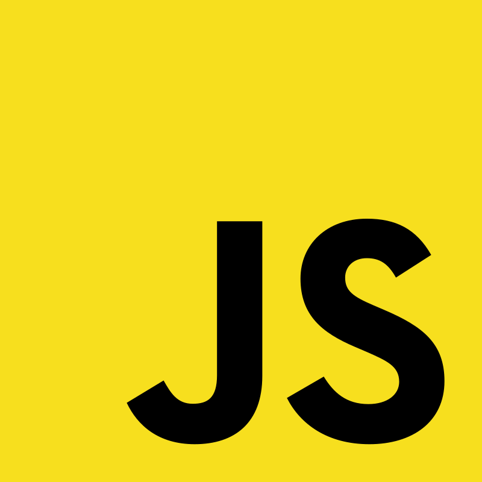   JS  | 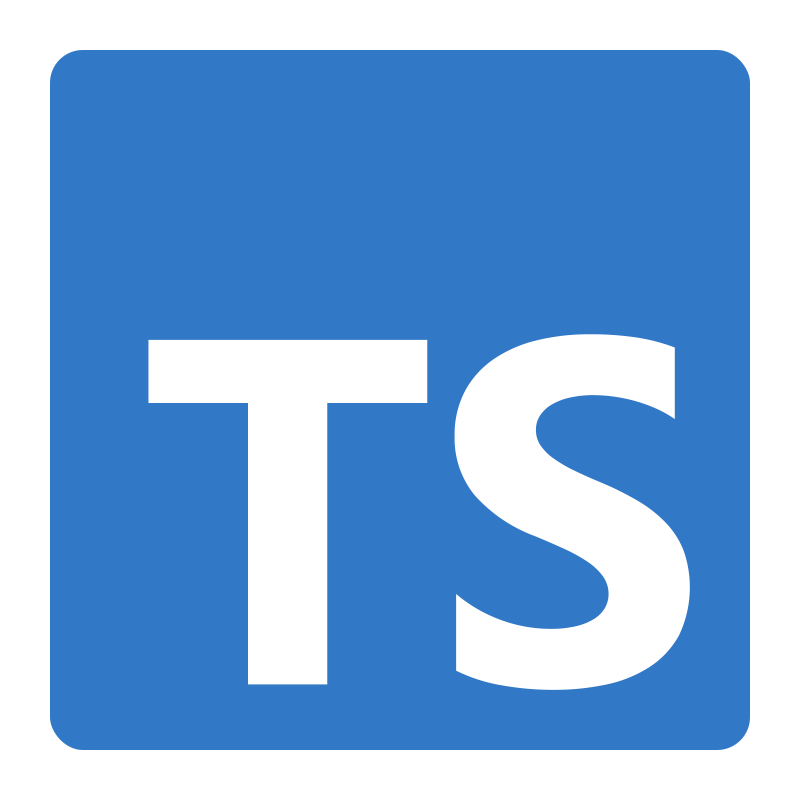   TS  | 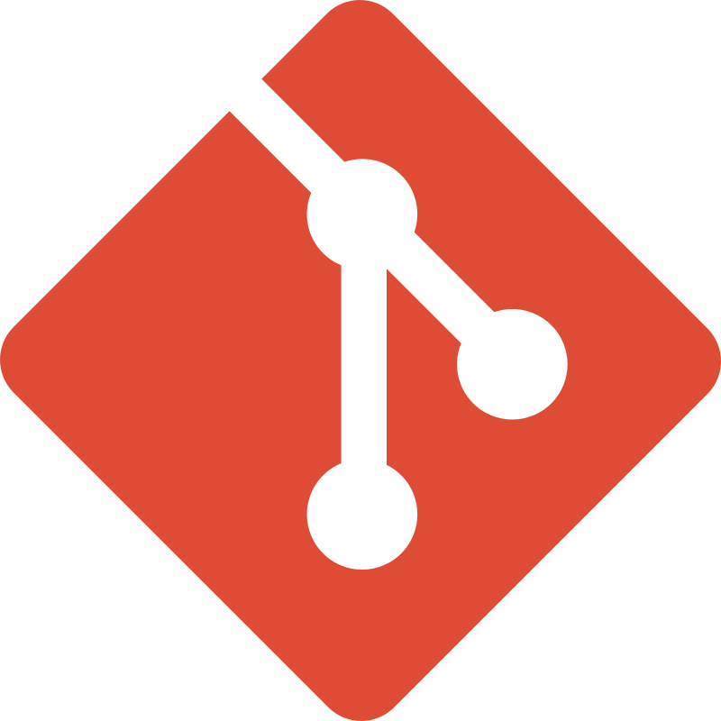   Git | 
|---|---|---|---|---|
| 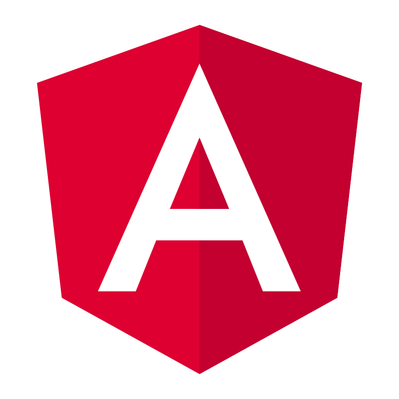   Angular  |    PostgreSQL  | 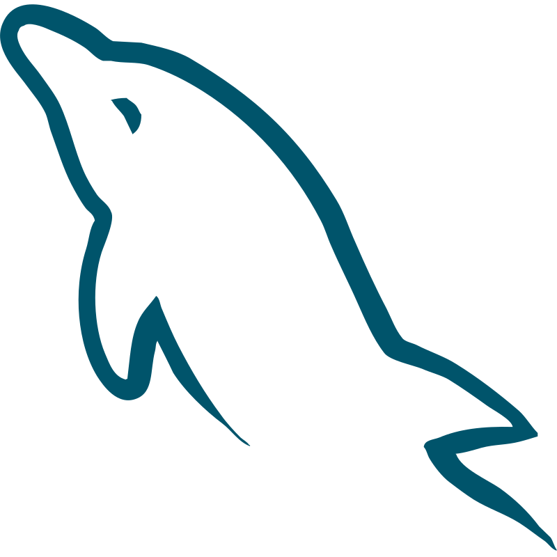   MySQL  | 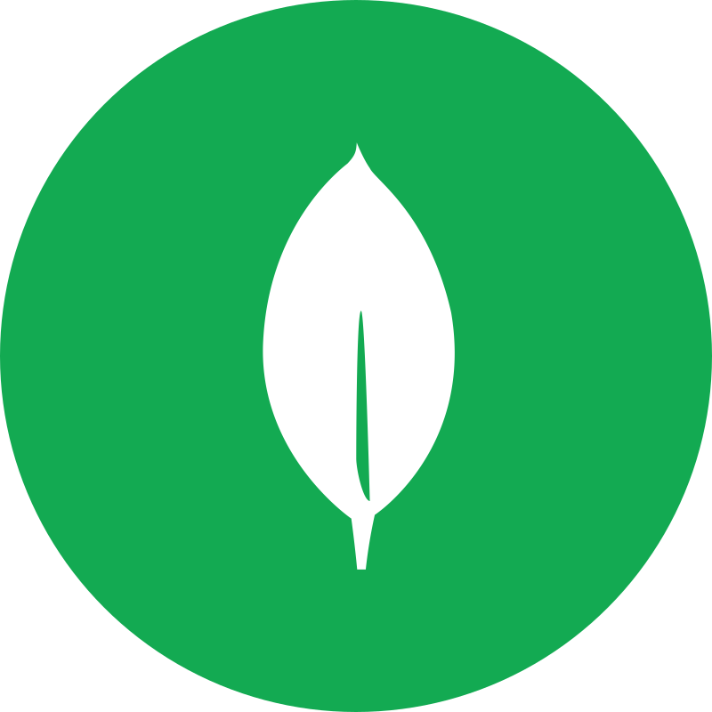   MongoDB  | 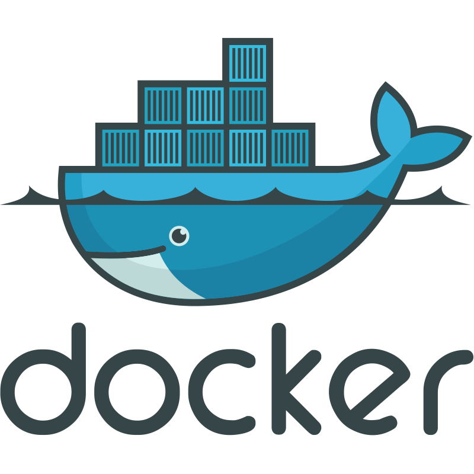   Docker

### My Goals

| 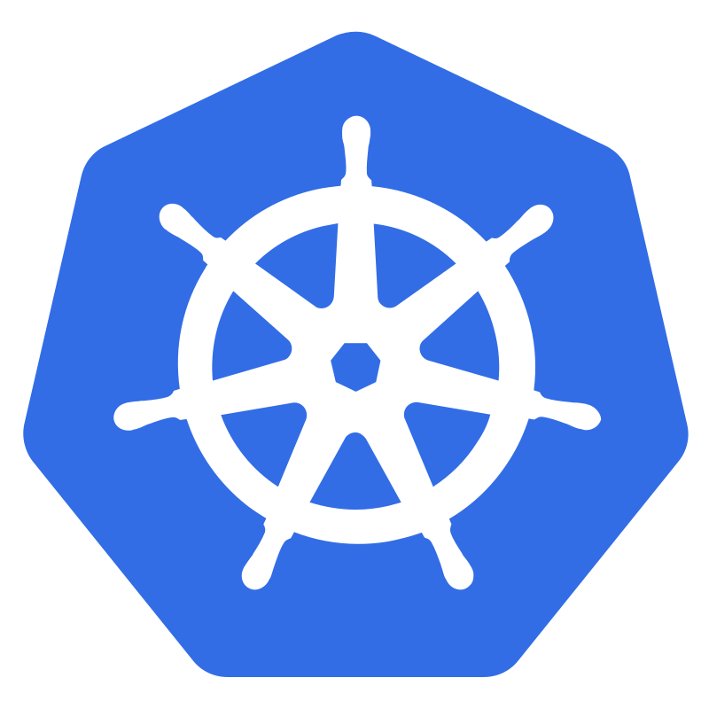   Kubernetes  |     AWS |    Golang | 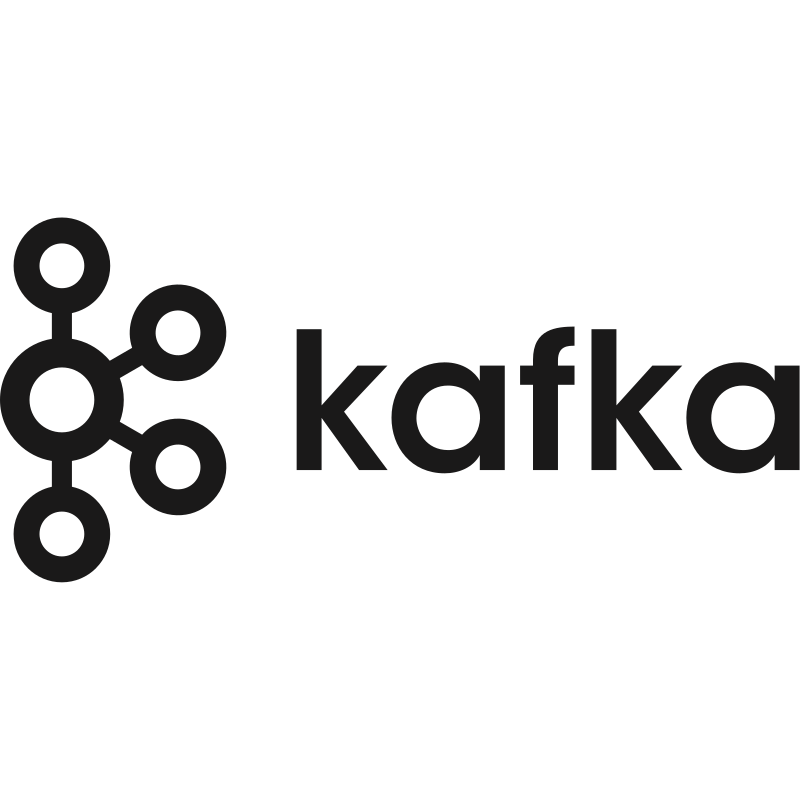   Kafka |    Prometheus |    Grafana |
|---|---|---|---|---|---| 
